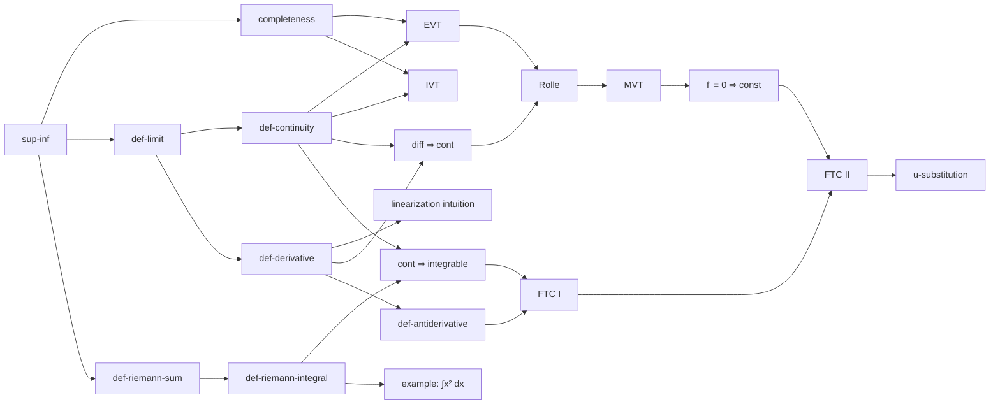

# Knowledge Tree (Math): Design Spec

**Date**: August 7, 2026 (expanded from the original one-page spec of the same date)
**Status**: Draft — decisions below are proposals with rationale; items marked *deferred* are intentionally unresolved.
**Summary**: Create a minimalist, smooth loading interface that contains an incredibly detailed complete graph of mathematical knowledge, starting for now with all the mathematics taught up to an undergraduate level.

**Vision**: I want this to become a tool where a user's current knowledge can be obtained and displayed as fulfilled nodes on the tree (which can possibly degrade over time). Then, to learn a new topic, they would have to branch off of the information they know now to reach that knowledge from prerequisites. Eventually, the tool will be a solution for learning anything (not just math): instead of learning off a standardized curriculum or textbook, a user will be given personalized learning that builds explanations from the user's knowledge, thought processes, problems encountered, and personal intuition, all of which the tool analyzes and incorporates into an entire standalone learning solution to teach the user. The philosophy behind this is that people have more similar intelligence than they think, and "gifted" students often just have prior knowledge or prior experience in the form of problems, solutions, etc, and that mastery before building further is important to learning.

This is currently a separate project that will in the future be connected as an extension to the Shifu app that obtains context from watching and analyzing the user's computer usage. See [§8.2](#82-shifu-boundary) for the integration boundary.

---

## 1. Scope

The only knowledge built into the graph is **pure mathematics up to and including a comprehensive undergraduate mathematics curriculum**. Concretely, the target coverage is the union of a strong undergraduate program:

- Foundations: logic, set theory, proof techniques
- Calculus sequence (single-variable, multivariable, vector calculus)
- Linear algebra (computational and proof-based)
- Real analysis, complex analysis, measure theory (intro)
- Abstract algebra (groups, rings, fields, Galois theory)
- Topology (point-set, intro algebraic)
- Probability theory and statistics (calculus-based)
- Combinatorics and graph theory
- Number theory
- Ordinary and partial differential equations
- Numerical analysis
- Differential geometry (curves/surfaces)

Out of scope for now: applied domains (physics, CS), graduate-level material, and any non-math knowledge. The graph model, however, must not hard-code anything math-specific that would block the eventual generalization (see [§10](#10-non-goals)).

---

## 2. Graph Model

### 2.1 Node taxonomy

Every node has exactly one **kind**. Kinds split into *structural* nodes (navigation and clustering) and *content* nodes (actual knowledge a user can master).

**Structural kinds** (not learnable, no score):

| Kind | Meaning | Example |
|---|---|---|
| `branch` | A top-level branch of mathematics | Analysis, Algebra, Combinatorics |
| `subbranch` | A coherent sub-area, roughly course- or chapter-sized | Real Analysis → "Sequences and Series" |

**Content kinds** (learnable, scored):

| Kind | Meaning | Example |
|---|---|---|
| `definition` | A precise mathematical definition | ε–δ definition of a limit |
| `axiom` | A foundational assumption | Completeness axiom of ℝ |
| `theorem` | A named or substantive result | Mean Value Theorem |
| `lemma` | A small supporting result (the "Lemma 2.6.3" granularity) | Rolle's Theorem as a stepping stone to MVT |
| `proposition` | A modest standalone result | Continuous functions on [a,b] are Riemann integrable |
| `corollary` | A direct consequence of a theorem | f′ ≡ 0 on an interval ⇒ f constant |
| `technique` | A method/skill, not a statement | u-substitution, diagonalization procedure |
| `example` | A classic worked example or problem whose content is itself knowledge | Computing ∫₀¹ x² dx from Riemann sums; the Cantor set |
| `intuition` | A mental model or informal picture worth tracking explicitly | "The derivative is local linear approximation" |

"Major theorem" is **not** a separate kind. Importance is orthogonal to kind, so every node instead carries a `prominence` field:

- `prominence: 0` — fine-grained detail (most lemmas, examples)
- `prominence: 1` — standard topic
- `prominence: 2` — landmark result (FTC, SVD, Sylow theorems, Central Limit Theorem)
- Structural nodes are implicitly maximal prominence for display purposes.

Prominence drives display (size, label visibility at overview zoom — see [§6](#6-display)), not semantics.

### 2.2 Atomicity invariant

The original spec's granularity requirement, stated as a rule:

> **If any node would ever require only *part* of another node as a prerequisite, the prerequisite node must be split until the dependency consumes it whole.**

This is the acceptance test for node granularity during content authoring. It is why nodes go down to the "Lemma 2.6.3" level: a prerequisite edge means *all* knowledge in the source node is required to learn the destination node. When a reviewer finds a violation (e.g., a node "Limits of functions" where some consumers only need one-sided limits), the fix is always to split the node, never to weaken the edge semantics.

Practical corollaries:

- Prefer many small nodes over few large ones; the display layer is responsible for making scale manageable, not the content layer.
- A `theorem` node covers the *statement and understanding* of the theorem; if its proof is itself substantial knowledge with its own prerequisites, the proof is a separate node (`lemma`/`technique`/`example` as appropriate) that `requires` the statement node.

### 2.3 Edge types

The original spec describes three different relationships that must not be conflated. Each is its own edge type:

**1. `contains` — taxonomy edges (structural).**
`branch → subbranch → content node`. These exist for navigation, clustering, and layout — knowing the "Algebra" hub is *not* a prerequisite for anything, so these are explicitly not prerequisite edges. Every content node has exactly one *primary* `contains` parent (its home subbranch) and may have additional *secondary* parents for cross-listed topics (e.g., generating functions live in Combinatorics, cross-listed under Probability). Primary parents form a tree; with secondary parents the taxonomy is a DAG.

**2. `requires` — prerequisite edges (hard, directed).**
`source → destination` means the destination node cannot be properly learned without full mastery of the source node ([§2.2](#22-atomicity-invariant)). Invariants:

- The `requires` subgraph must be a **DAG** — cycle detection is a mandatory validation step ([§3.3](#33-storage--validation)).
- Store only **direct** prerequisites (the transitive reduction). "A requires B requires C" implies A transitively requires C; writing `A requires C` explicitly is redundant and forbidden, so that the graph stays clean and ancestor sets are computed, not authored.
- Semantics are **AND**: all incoming `requires` edges must be satisfied. (Alternative "OR-routes" into a topic are a real phenomenon in math; they are an open question, [§11](#11-open-questions), not in v1.)

**3. `relates` — conceptual-relation edges (soft, undirected).**
Non-prerequisite connections where knowing one node aids understanding of the other — e.g., fixed-point theorems ↔ stationary/ergodic theorems in stochastic processes. These edges:

- carry a short `note` explaining the connection (the connection itself is knowledge);
- are **scored** per-user like content nodes are ([§4.4](#44-edge-scores)) — a user can know both endpoints but not the connection;
- have no acyclicity or direction constraints.

### 2.4 Resolving the hub/hierarchy tension

The original spec asks for central branch nodes *and* a strict prerequisite hierarchy. The edge-type split resolves this: hubs and their `contains` edges give the graph its recognizable branch structure for display and navigation, while `requires` edges independently encode the true learning order — which freely crosses branch boundaries (e.g., `analysis.real.completeness-axiom` is a prerequisite for results in topology and probability).

---

## 3. Data Model

### 3.1 Node schema

```yaml
id: analysis.svc.ftc-part-2          # stable, namespaced slug: <branch>.<subbranch-abbrev>.<slug>
kind: theorem                        # §2.1
prominence: 2                        # 0 | 1 | 2
title: "Fundamental Theorem of Calculus, Part II"
statement: >                         # precise content of the node (LaTeX allowed, $...$)
  If $f$ is continuous on $[a,b]$ and $F$ is any antiderivative of $f$,
  then $\int_a^b f(x)\,dx = F(b) - F(a)$.
summary: >                           # one-to-two sentence informal gloss, used in UI tooltips
  Evaluating a definite integral reduces to finding an antiderivative.
parent: analysis.svc                 # primary contains-parent (subbranch id)
also_under: []                       # secondary contains-parents, optional
requires:                            # direct prerequisites only (§2.3)
  - analysis.svc.ftc-part-1
  - analysis.svc.zero-deriv-const
relates:
  - id: analysis.mvc.leibniz-rule
    note: "Both express integral–derivative interchange."
tags: []                             # free-form, for search/filtering
```

Notes:

- **IDs are permanent.** Renaming a title is free; changing an id is a migration. Slugs are lowercase-kebab.
- `requires` and `relates` are authored on the *destination* node (the node that needs the prerequisite / the node where the connection was noticed); tooling builds the reverse indexes.
- Structural nodes use the same schema minus `statement`/`requires`/`relates`.

### 3.2 User-state schema (separate from content)

Content is a shared, versioned artifact; user state is private and references content by id. Kept separate so content updates never rewrite user data.

```yaml
node_states:
  analysis.svc.ftc-part-2:
    fsrs:                    # FSRS memory state, §4.2
      stability: 42.3
      difficulty: 5.1
      last_review: 2026-08-01T10:00:00Z
    history:                 # append-only review log (source: test | self-report | implicit | shifu)
      - { at: 2026-08-01T10:00:00Z, grade: good, source: test, problem: prob-0142 }
edge_states:
  "analysis.svc.ftc-part-2 ~ analysis.mvc.leibniz-rule":
    fsrs: { ... }
```

A node with no entry is **unlearned** (rendered gray, [§6](#6-display)) — distinct from learned-but-decayed. The review `history` is the ground truth; FSRS state is a cache recomputable from it, which also means the scoring algorithm can be improved later and replayed over history. *The efficient storage/query structure for large-scale user context is explicitly deferred* (original spec: "figure out later") — candidates in [§11](#11-open-questions).

### 3.3 Storage & validation

- **Content lives in this repo** as YAML: `content/<branch>/<subbranch>.yaml`, one file per subbranch holding its nodes; edges may reference any node id across files. Rationale: reviewable diffs, no database until scale demands one, git history doubles as content versioning.
- A **validation script** (CI + pre-commit) enforces: unique ids, no dangling references, `requires` acyclicity, no transitive-redundant `requires` edges, schema shape, exactly one primary parent. Atomicity ([§2.2](#22-atomicity-invariant)) can't be fully automated but the reviewer checklist lives next to the script.
- The build step compiles all YAML into a single `graph.json` plus a **precomputed layout** ([§6.4](#64-loading--performance)) consumed by the client.

---

## 4. Scoring

### 4.1 What the score means

A node's score is its **current retrievability**: the modeled probability the user can retrieve/apply that knowledge right now, in [0, 1]. It decays continuously between reviews and is recomputed on read from FSRS state — no cron job mutates scores.

### 4.2 FSRS base

Per-node memory is modeled with **FSRS** (Free Spaced Repetition Scheduler): each node tracks a *stability* (how slowly retrievability decays) and *difficulty*, updated on each review from a grade (`again | hard | good | easy`). Retrievability at time *t* is a decaying function of elapsed time and stability. *(Exact parameterization and update equations: adopt the current published FSRS reference implementation at build time rather than transcribing formulas into this spec — the algorithm is versioned and the review log ([§3.2](#32-user-state-schema-separate-from-content)) lets us re-fit or upgrade later.)*

FSRS normally answers "when should we schedule the next review?" Here it additionally answers "what color is this node right now?" — same model, two read-outs.

### 4.3 Graph-aware propagation (the extension)

The original spec's key insight: reviewing a node *exercises its prerequisites* (long division exercises subtraction and division). Mechanism:

- When node **N** receives an explicit review with grade *g*, every `requires`-ancestor **A** within distance *d* ≤ `D_max` receives an **implicit review** with a damped weight **γᵈ** (proposed defaults: γ = 0.5, `D_max` = 3; tune empirically).
- An implicit review boosts stability by a fraction of what an explicit review would, and is recorded in `history` with `source: implicit` so it is auditable and replayable.
- Implicit reviews never *lower* a score: a failed review of N is evidence about N (and possibly its prerequisites, but attribution is ambiguous — see diagnosis in [§5.4](#54-ongoing-review--diagnosis)), so failure propagates as a *flag for retesting*, not as a penalty.
- Problems can also name the specific prerequisite nodes they exercise ([§5.2](#52-problems-as-the-evidence-instrument)); explicitly-exercised nodes get full-strength implicit reviews regardless of graph distance.

This is the "FSRS incorporating graph data as a parameter" requirement made concrete: graph structure modulates the *review stream* each node sees, while the per-node memory model stays standard FSRS (keeping it fittable and debuggable).

### 4.4 Edge scores

`relates` edges carry their own FSRS state ([§3.2](#32-user-state-schema-separate-from-content)): the connection between two topics is knowledge over and above the endpoints. An edge review happens when a problem explicitly exercises the connection (e.g., a problem solved *by transferring* a fixed-point argument into an ergodic setting). Edge scores render as the edge's color intensity.

### 4.5 Color mapping

- **Unlearned** (no state): neutral gray, low opacity — visually recedes.
- **Learned**: continuous gradient by retrievability, from badly decayed (≈0.3) to solid (≈0.95+). Decayed nodes remain visibly *colored* (they were learned) but dim and washed out, distinct from gray unlearned nodes.
- **Frontier** (unlearned, all prerequisites above a mastery threshold τ ≈ 0.85): gray with a subtle accent ring — these are "what you could learn next," the actionable set the whole product points at.

**Which channel carries it** (amended in turn 1, [DT1.1](implementation-plan.md#turn-1)): the gradient moves *luminance*, not hue. A node's hue is its branch's, so the map encodes two independent facts at once — where in mathematics a node sits, and how well it is known. On the dark canvas a solid node is bright and a decayed one sinks toward the background; on the light one a solid node is dense ink and a decayed one is washed out. The original proposal — a deep-blue → teal → green hue walk — survives as the *model's* colour: `ScoreRamp` still computes it, the probe still prints it, and it is what the scoring tests pin. What the display shows is a function of that model's ramp position, not of its colour.

---

## 5. User Context & Assessment

### 5.1 Evidence model

All knowledge about the user arrives as **evidence events**: `{node ids (and/or edge ids), grade or confidence, source, timestamp}`. Sources: `test` (answered a problem here), `self-report` (user marks "I know this"), `implicit` (propagation, §4.3), `shifu` (observed usage, §8.2). Everything downstream — scores, colors, scheduling — is a fold over the evidence log.

### 5.2 Problems as the evidence instrument

Each test problem is tagged with the node set it exercises: one or more **target** nodes (what it primarily tests) and **exercised** prerequisite nodes (what it necessarily drills in passing). Grading a problem emits evidence for all tagged nodes — full grade for targets, implicit boosts for exercised nodes — which is exactly the original spec's "prerequisites exercised by that problem should also be boosted."

### 5.3 Initial placement

Testing every node is impossible at this graph's size. Placement is **adaptive probing over the DAG**:

1. User (or Shifu context) coarsely seeds a claimed frontier — e.g., "finished multivariable calc, started real analysis."
2. Probe with problems at the claimed frontier. A pass raises the inferred probability of *all* `requires`-ancestors (passing an MVT application is strong evidence for derivatives, limits, continuity); a fail pushes probing down toward prerequisites.
3. Repeat, binary-search style, until inferred probabilities stabilize. Inferred (untested) knowledge is stored as low-confidence evidence — visibly distinct is unnecessary, but it decays faster until confirmed by a direct test.

Placement is optional and resumable: a user can skip it and let the picture fill in from ongoing use.

### 5.4 Ongoing review & diagnosis

- The FSRS scheduler surfaces due reviews; the user reviews via problems, not flashcard-style restatement, whenever possible.
- On a **failed** problem, the system disambiguates *which* knowledge failed: offer the prerequisite chain of the target node and let the user (or a follow-up micro-problem) localize the gap. The failure evidence lands on the localized node, not automatically on the whole chain.
- This is also the loop where "learning a new topic branches off known nodes": pick a goal node, compute its unmet prerequisite ancestors, order them topologically — that ordered set *is* the personalized syllabus. The goal may equally be a whole *subject* rather than one node ([§6.5](#65-subject-paths)); the computation is identical with a goal set instead of a goal.

---

## 6. Display

### 6.1 Overview: Obsidian-style graph, with discipline

Primary view is a minimalist force-directed graph (dot nodes, hairline edges) in the spirit of Obsidian's graph view — but at this node count, an undisciplined hairball is useless, so the design is **level-of-detail (LOD) first**:

- **Overview zoom**: only `branch`/`subbranch` hubs and `prominence: 2` nodes render labels; hubs render large; `prominence: 0` nodes shrink to near-dots; `contains` clustering dominates the layout so branches form visible galaxies.
- **Mid zoom**: subbranch neighborhoods; `prominence ≥ 1` labels appear; `requires` edges become distinguishable (subtle arrowheads) from `relates` edges (dashed/fainter).
- **Detail zoom**: everything labeled; hovering a node highlights its direct prerequisites and dependents; clicking opens the node panel (statement, summary, score, review history, "learn this" action).

Color encodes score throughout ([§4.5](#45-color-mapping)).

**Chrome and canvas** (amended in turn 1, [DT1.1](implementation-plan.md#turn-1)–[DT1.3](implementation-plan.md#turn-1)): the screen is two surfaces over the map — a rule-separated command line across the top and one detail column — in two appearances, *Observatory* on a near-black canvas and *Ledger* on paper, following the system. Edges are monochrome hairlines rather than blends of their endpoints' colors: with hue now naming the branch, a third color system on the same canvas is noise, and §4.4's edge score is carried as intensity, which is the form that section actually specifies.

### 6.2 Focus mode (the learning view)

Selecting a goal node switches to **focus mode**: the display reduces to the node's `requires`-ancestor subgraph, laid out left-to-right in topological order, colored by score. Met prerequisites are compressed; the unmet chain is prominent. This is the "branch off what you know to reach new knowledge" vision rendered literally, and it doubles as the syllabus view ([§5.4](#54-ongoing-review--diagnosis)). A breadcrumb returns to the full graph with a smooth animated transition (zoom-out, not a cut — continuity of place is part of the minimalist feel).

Turn 1 draws the topological order as *columns* rather than as a node-link diagram ([DT1.4](implementation-plan.md#turn-1)): one rule-separated stage per column, met stages small and quiet, the unmet chain at reading size, the goal last behind an accent rule, and a progress bar at the foot. Edges between stages are not drawn — the column a node sits in already says where it falls in the order, and its exact prerequisites are in the node panel.

### 6.3 Alternatives considered

- **Zoomable treemap / sunburst** by taxonomy: excellent overview density, but hides cross-branch `requires` edges — the product's whole point. Rejected as primary; may serve as a navigation sidebar later.
- **Hyperbolic tree**: elegant for pure hierarchies, same cross-edge weakness.
- **Star-map / galaxy metaphor** (fixed precomputed positions, pan/zoom like a map): actually complementary rather than an alternative — see §6.4; we adopt its key idea (offline layout) inside the force-graph aesthetic.

### 6.4 Loading & performance

"Minimalist, smooth loading" is a hard requirement, so:

- **Layout is precomputed offline** at content-build time and shipped as coordinates in `graph.json`. The client never runs a cold force simulation on the full graph; at most it runs local relaxation on the visible neighborhood. First paint is instant and deterministic (the map always looks the same — spatial memory becomes navigation).
- **GPU-accelerated rendering** is required at this scale (thousands of nodes, tens of thousands of edges); CPU-drawn canvas/SVG will not hold 60 fps. In the native macOS app this means Metal (instanced rendering) with SpriteKit as the fallback; a web client would use WebGL (sigma.js, Cosmograph). Choose after a render spike with a synthetic 10k-node graph (M1, [§9](#9-roadmap)).
- Progressive reveal on first load: hubs fade in first, then constellation fill — sub-second total, no spinners.

### 6.5 Subject paths

A user does not only arrive with "I want to understand the FTC". They arrive with **"I want to learn linear algebra"** — a subject, not a result. That is the same question with a goal *set*, so it is the same view ([§6.2](#62-focus-mode-the-learning-view)) with a different goal:

- The **targets** of a `branch` or `subbranch` goal are every content node it contains, at any taxonomy depth, following the `contains` DAG so cross-listed topics ([§2.3](#23-edge-types)) count as part of both subjects that list them. Structural nodes are never targets: they carry no score ([§2.1](#21-node-taxonomy)).
- The **path** is the unmet members of (targets ∪ their `requires`-ancestors), in the topological order [§5.4](#54-ongoing-review--diagnosis) defines. A subject's own nodes are steps like any other, so — unlike a single-node goal, which is the arrival rather than a step — they appear in the list.
- Steps *outside* the subject are marked as such. This is the point rather than a detail: at this granularity, "learn linear algebra" from cold is half foundations, and a path that hid that would be lying about the work. It is also [§2.4](#24-resolving-the-hubhierarchy-tension)'s cross-branch `requires` edges finally becoming something the user acts on rather than something the layout has to cope with.
- Progress is `met targets / targets` — the read-out a subject has and a single node does not, and the basis for a "which subject should I open" list, which is how a subject gets chosen without first finding its hub on a map the user does not know yet.

Everything else — met-boundary compression, the frontier's definition of "met", the left-to-right topological order — is §6.2 unchanged, which after turn 1 means the same stage columns ([DT1.7](implementation-plan.md#turn-1)): a subject's eyebrow reads LEARNING PATH rather than PREREQUISITE PATH, its imported steps are set quiet with their origin branch named, and its progress bar counts targets instead of the plan. A subject with no content authored yet ([§7.1](#71-process) fixes the outline before the content, so this is the common case for now) yields an empty path, which the display states rather than draws.

### 6.6 The program

§6.5 answers *"take me through linear algebra"*. The remaining question a curriculum obviously answers — and the one a learner starting from zero actually asks — is **"take me through all of it, in the order someone who knows the terrain chose"**. That order is not computable from the graph: `requires` yields a partial order with astronomically many linear extensions, and which one teaches well is pedagogy, not topology. So the program is **authored data, not a derived view**:

- **The spine.** An ordered list of every subbranch of the tree — the *units* — grouped into named *parts*. This is the corpus outline's authoring order made machine-readable, and it is validated, not trusted: every unit must exist and be a subbranch, appear exactly once, cover every authored subbranch, and the order must be a linear extension of the cross-unit `requires` relation (no node may require a node in a later unit). That last rule is what makes each unit a self-contained chapter: within a unit, ordering by `requires` needs only the unit's own edges.
- **Lessons.** Per content node, authored *teaching* text — the node's `statement` says what to know; the lesson says how to come to know it. Fixed sections, so the reader has a rhythm: **hook** (where this sits and why it earns a step), **explanation** (the actual teaching, several paragraphs), **worked** (an example computed to the end), **interview** (how it is asked under pressure), **pitfalls** (the standard traps), **recap** (one breath to retain). The first two and the last are required; the middle three are present wherever the node's kind can honestly fill them. Each unit also carries an **opening** — the paragraph a chapter starts with. This deliberately amends [§10](#10-non-goals)'s "no teaching content" for *authored* lesson corpora; what stays out of scope is generating explanations personalized to one user's history.
- **Two starting points, one derivation.** "From the beginning" shows every step in full detail; "from what I know" compresses the steps already mastered ([§4.5](#45-color-mapping)'s exact notion of met) to one quiet line each, expandable. The **resume point** is the first step in program order that has *never been learned* — deliberately not the first *unmet* step: a program bookmark means "where I got to", and one decayed foundations node must not yank it from unit 40 back to unit 3. Decay surfaces through the due list and through compression un-compressing, never by moving the bookmark.
- **Flexibility.** The program is a recommended order, not a lock: any unit and any lesson is openable at any time, the map, panel and focus mode all remain, and the panel links a node straight to its lesson. Position and progress are derived entirely from the evidence log ([§5.1](#51-evidence-model)) — the program keeps **no state of its own**, so reading a lesson and reporting it are the same acts they are everywhere else in the app.

Display follows turn 1's grammar: a table-of-contents rail (parts, units, met-of-total per unit, the resume marker), one reading column (the unit as a chapter: opening, then each step as title · statement · lesson sections), the self-report action at each lesson's foot, and a progress bar over the whole program at the base. The program ships first for the quant-interview tree, whose corpus was authored against a fixed outline order; any tree gains it by authoring a spine and lessons.

---

## 7. Content Pipeline

The biggest gap in the original spec: at Lemma-2.6.3 granularity, undergraduate math is on the order of **5,000–15,000 nodes**. They have to come from somewhere.

### 7.1 Process

1. **Canonical outline first**: fix the `branch`/`subbranch` skeleton (from [§1](#1-scope)) by hand. This is small (~15 branches, ~80–120 subbranches) and load-bearing; it does not get delegated.
2. **LLM-assisted extraction** per subbranch: from standard course structures and open textbooks' tables of contents/theorem indexes, an LLM drafts candidate nodes (kind, statement, prerequisites) in the schema of [§3.1](#31-node-schema).
3. **Human review** against the invariants: atomicity ([§2.2](#22-atomicity-invariant)), transitive-reduced `requires`, correct kind. The validation script catches the mechanical violations; a reviewer checks the mathematical ones. Nothing merges without review — prerequisite edges are the product; wrong edges are worse than missing nodes.
4. `relates` edges are added opportunistically and continuously — they are discovered, not enumerated.

### 7.2 Phased scope

Build **one course end-to-end first** — proposal: **single-variable calculus** (familiar, rich in every node kind, and its prerequisite chains run deep into precalc/foundations, which stress-tests the model). Validate taxonomy, atomicity, scoring, and display against it before scaling to the next subbranch. Scaling is embarrassingly parallel per-subbranch once the process is proven; cross-branch `requires` edges are the integration step.

---

## 8. Architecture & Tech Stack

### 8.1 Stack

Decided: **native macOS app in Swift** — SwiftUI shell, Metal-backed graph rendering (per §6.4's spike), one SwiftPM package (`GraphCore` model/scoring library + `ContentBuild` tooling). Phasing, targets, and per-phase exit criteria live in [implementation-plan.md](implementation-plan.md).

- **Content**: YAML in-repo → compiled `graph.json` + precomputed layout (build tooling; YAML parsing stays in tooling — the app consumes JSON only).
- **User state**: local-first — append-only evidence log with the FSRS state as a recomputable cache; no account/backend in v1. Sync/serverside becomes relevant with Shifu integration.
- **Scoring engine**: pure functions over the evidence log, isolated from UI, replayable (enables algorithm upgrades and offline evaluation of γ/D_max, [§4.3](#43-graph-aware-propagation-the-extension)).

### 8.2 Shifu boundary

Shifu integration is a **data contract, not a code dependency**: Shifu will push evidence events ([§5.1](#51-evidence-model)) — `{node ids, confidence, source: shifu, timestamp}` — inferred from observed computer usage, through the same evidence API every other source uses. This project owns the graph, scoring, and display; Shifu owns observation and inference-to-node mapping. Nothing else about Shifu is this spec's concern.

---

## 9. Roadmap

- **M0 — Spec + seed content**: this document; hand-built worked-example subgraph (Appendix A) in real schema; validation script.
- **M1 — Viewer**: render spike (10k synthetic nodes) → renderer choice; precomputed-layout pipeline; overview + zoom LOD + node panel, static colors.
- **M2 — Single-variable calculus content** ([§7.2](#72-phased-scope)) fully authored and validated.
- **M3 — Scoring**: evidence log, FSRS, self-report reviews, color-by-score, frontier highlighting, focus mode.
- **M4 — Assessment**: tagged problem bank for the built content; adaptive placement; graph-propagated implicit reviews.
- **M5 — Scale content** across the undergraduate curriculum, subbranch by subbranch.
- **M6 — Shifu integration** via the evidence contract.
- **M7 — Subject paths** ([§6.5](#65-subject-paths)): a branch or subbranch as the goal, chosen by name.
- **M8 — The program** ([§6.6](#66-the-program)): an authored curriculum over a whole tree — spine, lessons, reader — quant tree first.

---

## 10. Non-Goals

- Non-math domains and beyond-undergraduate math (the graph model must merely not preclude them).
- Generating *teaching* content (explanations, lessons) — v1 tracks and sequences knowledge; the personalized-explanation engine of the Vision is a later layer on top of the same graph. *(Amended by [§6.6](#66-the-program): an **authored** lesson corpus with an authored teaching order is in scope; what stays out is generating explanations on the fly, personalized to one user.)*
- Building or specifying Shifu itself.
- Accounts, sync, multi-user, or social features.

---

## 11. Open Questions

1. **User-context storage structure** — explicitly deferred by the original spec. Candidates when local YAML/IndexedDB stops sufficing: event-sourced log + materialized score cache (current design already leans this way), embedded SQLite, or a graph DB if per-user edge state grows large.
2. **OR-prerequisites**: some topics admit alternative learning routes (determinants before or after linear maps). v1 is AND-only ([§2.3](#23-edge-types)); if authoring keeps fighting this, add prerequisite *groups* (any-of within a group, all groups required).
3. **Propagation constants**: γ, `D_max`, and implicit-review strength are guesses until there's review data to fit against; the replayable evidence log exists partly for this.
4. **FSRS parameterization**: adopt reference implementation as-is vs. re-fitting weights once enough native review data accumulates.
5. **Score decay for inferred (untested) knowledge**: faster-than-FSRS decay is proposed ([§5.3](#53-initial-placement)) but the rate is unstudied.
6. **Edge-score review UX**: how a problem "tests a connection" without feeling artificial.

---

## Appendix A: Worked-example subgraph (single-variable calculus → FTC)

Illustrative only (~20 nodes) — exercises every node kind and edge type. Ids here use abbreviated prefixes for table width (`an.svc.` = analysis / single-variable calculus, `fnd.` = foundations); canonical ids follow the [§3.1](#31-node-schema) convention (`analysis.svc.…`).

| id | kind | prom. | title |
|---|---|---|---|
| `analysis` | branch | — | Analysis |
| `an.svc` | subbranch | — | Single-Variable Calculus |
| `fnd.real.completeness` | axiom | 1 | Completeness axiom of ℝ |
| `fnd.real.sup-inf` | definition | 1 | Supremum and infimum |
| `an.svc.def-limit` | definition | 2 | ε–δ limit of a function |
| `an.svc.def-continuity` | definition | 1 | Continuity at a point |
| `an.svc.evt` | theorem | 1 | Extreme Value Theorem |
| `an.svc.ivt` | theorem | 1 | Intermediate Value Theorem |
| `an.svc.def-derivative` | definition | 2 | Derivative at a point |
| `an.svc.intuition-linearization` | intuition | 0 | Derivative as local linear approximation |
| `an.svc.diff-implies-cont` | lemma | 0 | Differentiability ⇒ continuity |
| `an.svc.rolle` | lemma | 0 | Rolle's Theorem |
| `an.svc.mvt` | theorem | 1 | Mean Value Theorem |
| `an.svc.zero-deriv-const` | corollary | 0 | f′ ≡ 0 ⇒ f constant |
| `an.svc.def-riemann-sum` | definition | 0 | Riemann sum |
| `an.svc.def-riemann-integral` | definition | 1 | Riemann integral |
| `an.svc.cont-integrable` | proposition | 0 | Continuous on [a,b] ⇒ integrable |
| `an.svc.ex-integral-x2` | example | 0 | ∫₀¹ x² dx from Riemann sums |
| `an.svc.def-antiderivative` | definition | 0 | Antiderivative |
| `an.svc.ftc-1` | theorem | 2 | FTC, Part I |
| `an.svc.ftc-2` | theorem | 2 | FTC, Part II |
| `an.svc.u-sub` | technique | 1 | u-substitution |

Direct `requires` edges (transitive reduction):



`contains` edges: `analysis ⊃ an.svc ⊃` all `an.svc.*` nodes; `fnd.*` nodes live under a Foundations branch (elided).

Sample `relates` edge: `an.svc.ftc-2 ~ an.mvc.leibniz-rule` — *"both express integral–derivative interchange"* (endpoint in a neighboring subbranch, showing cross-file references).

Things this example demonstrates: the proof-vs-statement split (Rolle is a separate `lemma` feeding MVT), atomicity (antiderivative is its own node because FTC-I needs exactly it), transitive reduction (FTC-II does not list `def-limit` — it's an ancestor via every path), the example-as-node kind, and a corollary (`zero-deriv-const`) that is itself a real prerequisite for FTC-II's standard proof.
